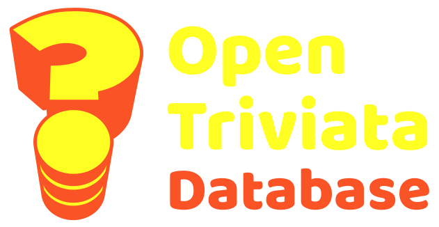

# Open Triviata Database API

  

## Table of Contents

[Description](#description) [Usage](#usage) [Contributing](#contributing) [Questions](#questions) 

## Description

The [Open Trivia Database API](https://otriviata.com/) provides ID-numbered verified questions sourced from the [Open Trivia Database](https://opentdb.com/).

I was intending to use the Open Trivia Database to source questions for a website allowing users to create and share their own quizzes. While planning this, I discovered that the Open Trivia API does not return question IDs. This made the task of storing quizzes much trickier, so I decided that instead of creating a quiz site, I'd focus on creating something that might be useful to other developers - an API that *would* return ID numbers.

I broke the task into two major sub-projects - a [synchroniser programme](https://github.com/paulashby/open-triviata-synchroniser-php) to add all validated Open Trivia questions to the project database and this API to retrieve questions from my own synchronised database.

The Open Triviata API accepts all the same requests and parameters as the original Open Trivia API and structures the returned data in exactly the same way but with the inclusion of question ID numbers and the option to retrieve unencoded data.

The only exception to this is the global question count lookup which is more simply structured as it includes only verified questions.

Requesting a session token returns the name of a newly-created json file.
This file used to store the IDs of subsequently retrieved questions.

When retrieving questions from the database, these stored IDs are used in MySQL calls to exclude questions from responses.

Resetting a token empties the array in the json file.

I took the text for the index page from the Open Trivia API documentation webpage, then made use of the UIKit framework when writing my own HTML, CSS and Javascript.

Given the fact that I was making the API available on a shared server, I also wrote a [rate limiter](https://github.com/paulashby/rate-limiter) (which turned out to be a bit of a project in itself). 

## Usage

Please see the documentation on the [Open Trivia Database site](https://otriviata.com/).

In addition to the static documentation, the page also allows you to build a request strings using either question ID numbers or the following parameters that follow the Open Trivia convention:
- Number of questions
- Category
- Difficulty
- Question type
- Encoding of returned data

## Contributing

If you feel you could contribute to the API in some way, simply fork the repository and submit a Pull Request. If I like it, I may include it in the codebase.

## Questions

Feel free to [email me](mailto:paul@primitive.co?subject=OpenTriviataDatabase%20query%20from%20GitHub) with any queries. If you'd like to see some of my other projects, my GitHub user name is [paulashby](https://github.com/paulashby).
